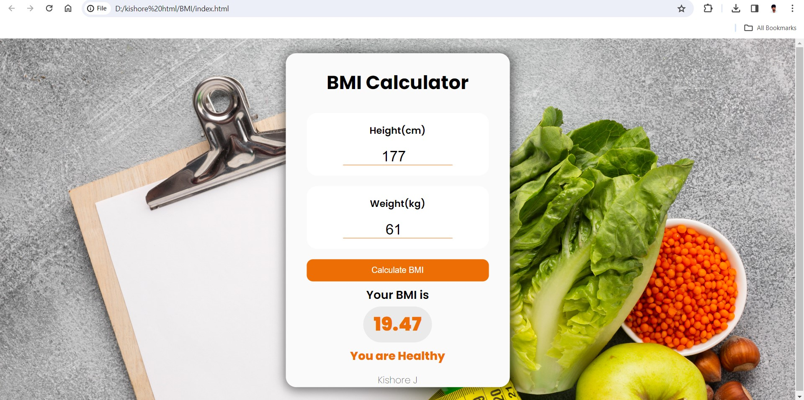

# BMI Calculator 🧮
BMI Calculator is a simple web-based application designed to calculate a user's Body Mass Index (BMI) based on their height and weight. Built with HTML, CSS, and JavaScript, this project is a great example of an interactive frontend application.

